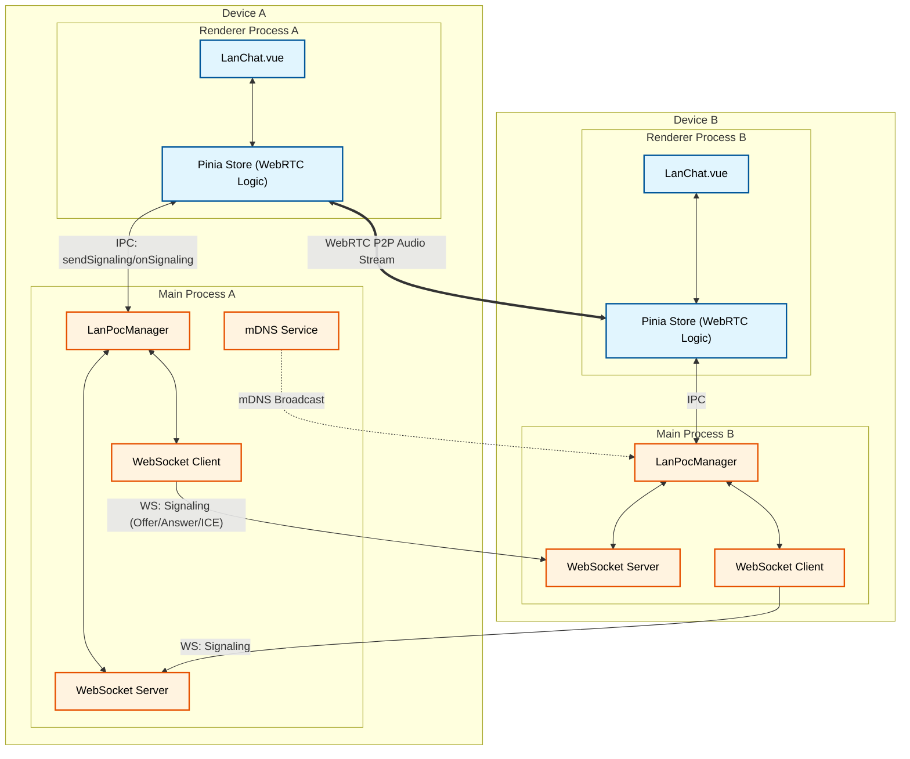

# LAN & Voice Call System Architecture

## Overview
The application implements a serverless, peer-to-peer (P2P) Local Area Network (LAN) communication system within an Electron environment. It facilitates peer discovery, text chat, and voice calling without requiring external servers or internet access.

## Core Components

### 1. Main Process (Backend)
This layer handles low-level networking and orchestration.
-   **`LanPocManager`**: The central controller. It initializes the WebSocket server, discovery service, and client. It routes incoming messages to the renderer via IPC.
-   **`LanDiscovery`**: Uses **mDNS (Bonjour)** to publish the local service (`_my-lan-app._tcp`) and discover other peers on the same subnet.
-   **`LanWsServer`**: An ephemeral WebSocket server that listens for incoming connections. It processes:
    -   **Handshakes**: `HELLO` messages with device info.
    -   **Chat**: `CHAT_MESSAGE` payloads.
    -   **Signaling**: `CALL_OFFER`, `CALL_ANSWER`, `ICE_CANDIDATE` for voice calls.
-   **`LanWsClient`**: A transient WebSocket client used to send messages. It connects, sends a message, and disconnects (ephemeral connection model) to manage resources efficiently.

### 2. Renderer Process (Frontend/UI)
This layer manages state, user interaction, and media streams.
-   **`useLanStore` (Pinia)**: The "brain" of the frontend.
    -   Maintains lists of peers and chat logs.
    -   Manages the **WebRTC** state (`RTCPeerConnection`, `MediaStream`).
    -   Handles call logic (initiate, answer, hangup).
-   **`LanConnect.vue`**: UI for starting/stopping the LAN service and viewing discovered peers.
-   **`LanChat.vue`**: The main communication interface. Displays chat history and handles the mechanics of sending text and starting calls.
-   **`electronAPI` (Preload)**: A secure bridge exposing specific main-process capabilities (like `sendSignaling`, `onPeersUpdated`) to the renderer.

## Communication Flows

### Peer Discovery (mDNS)
1.  **Start**: User clicks "Start LAN". `LanPocManager` spins up `LanWsServer`.
2.  **Publish**: `LanDiscovery` broadcasts the service on the local subnet via mDNS.
3.  **Discover**: Other peers detecting the broadcast trigger `onPeersUpdated`, pushing the new peer list to the UI.

### Text Chat (WebSocket)
1.  **Send**: User types a message. `useLanStore` calls `sendChat` via IPC.
2.  **Transport**: `LanWsClient` connects to the target peer's `LanWsServer`, sends the JSON payload, and disconnects.
3.  **Receive**: Target's `LanWsServer` receives the message and sends it to the renderer via `lan:chatMessage`.
4.  **Display**: Store updates `chatMessages` and UI renders it.

### Voice Calling (WebRTC + WebSocket Signaling)
Voice calls use a **Hybrid P2P** approach. Signalling is done over the existing WebSocket mechanism, while audio streams flow directly between Renderers via WebRTC.

1.  **Offer**:
    -   Caller creates `RTCPeerConnection` and generated an SDP Offer.
    -   Caller sends `CALL_OFFER` via `sendSignaling` (IPC -> Main -> WS -> Peer Main -> IPC -> Peer Renderer).
2.  **Answer**:
    -   Receiver accepts. Creates `RTCPeerConnection`, sets Remote Description, generates SDP Answer.
    -   Receiver sends `CALL_ANSWER` back via the same WebSocket signaling path.
3.  **ICE Candidates**:
    -   As network paths are discovered, `ICE_CANDIDATE` messages are exchanged via signaling to establish connectivity.
4.  **Audio Stream**:
    -   Once connected, browser-native WebRTC establishes a direct UDP/TCP media stream between the two Renderer processes.

## Architecture Diagram

The diagram below illustrates the end-to-end communication architecture between two devices (A and B). It highlights the separation of concerns between the **Main Process**, which handles network discovery and WebSocket transport for signaling and chat, and the **Renderer Process**, which manages the UI and the direct WebRTC peer-to-peer audio stream. The **Electron IPC** bridge securely connects these two layers. mDNS broadcasts facilitate initial discovery, allowing the Main Processes to establish WebSocket connections for signaling (exchanging Offers/Answers/ICE). Once signaling is complete, the Renderer processes establish a direct, high-performance WebRTC connection for the audio stream, bypassing the Main Process for media transport.

