# System Architecture

## Overview
This application is a local-first Electron desktop app designed for productivity and decentralized communication. It combines a Vue.js frontend with an Electron main process backend, connected via a secure IPC bridge.

## High-Level Architecture

### Frontend (Renderer Process)
-   **Framework**: Vue 3 + Vite.
-   **State Management**: Pinia. Stores are modularized by domain (Tasks, LAN, Focus, Settings).
-   **Routing**: Vue Router.
-   **Styling**: Vanilla CSS with a custom design system.

### Backend (Main Process)
-   **Runtime**: Electron (Node.js).
-   **Persistence**: `electron-store` for JSON file storage.
-   **Networking**: Native Node.js `net`, `dgram`, and `ws` modules for LAN communication.
-   **Window Management**: Standard Electron `BrowserWindow` orchestration.

### IPC Bridge (Preload Script)
-   **Security**: Context Isolation is enabled. Node.js integration is disabled in the renderer.
-   **API**: Exposed via `window.electronAPI`.
-   **Pattern**: Request/Response (Promises) for data fetching, and Event Emitters (Callbacks) for real-time updates (LAN peers, chat).

## Core Systems

### 1. Productivity System
Manages tasks, work logs, and focus sessions.
-   **Data Flow**: Renderer Store -> IPC -> Main Process Handler -> File System (JSON).
-   **Key Stores**: `useTasksStore`, `useLogsStore`, `useFocusStore`.

### 2. LAN Communication Sytem
A serverless, peer-to-peer mesh network.
-   **Discovery**: mDNS (Bonjour).
-   **Signaling/Chat**: Ephemeral WebSocket connections.
-   **Voice**: WebRTC P2P streams using WebSocket signaling.
-   **Key Components**: `LanPocManager` (Main), `useLanStore` (Renderer).
    -   **Current Call Limitation**: Signaling is scoped to discovered/manual peers. If the sender IP cannot be matched to a known peer (hostname or multi-interface mismatches), the call is ignored. ICE candidates are buffered until a remote description is set to avoid signaling races.

### 3. Utility System
-   **Excel Center**: Integrates `xlsx` for importing/exporting data.
-   **Share Center**: Handles clipboard and file sharing operations.

## Diagram

```mermaid
graph TD
    subgraph "Renderer Process (Vue 3)"
        Router[Vue Router]
        
        subgraph "Pinia Stores"
            TaskStore[Tasks Store]
            LogStore[Logs Store]
            FocusStore[Focus Store]
            LanStore[LAN Store]
        end
        
        Router --> TaskStore
        Router --> LanStore
    end

    subgraph "IPC Bridge (Context Isolated)"
        API[window.electronAPI]
    end

    subgraph "Main Process (Node.js)"
        IPCMain[IPC Handlers]
        
        subgraph "Modules"
            TaskManager[Task Manager]
            LogManager[Log Manager]
            LanManager[LanPocManager]
        end
        
        subgraph "LAN Services"
            WSS[WebSocket Server]
            MDNS[mDNS Service]
        end
        
        Storage[(JSON Storage)]
    end

    %% Connections
    TaskStore <-->|IPC Tasks| API
    LanStore <-->|IPC LAN| API
    
    API <--> IPCMain
    
    IPCMain --> TaskManager
    IPCMain --> LanManager
    
    TaskManager --> Storage
    
    LanManager --> WSS
    LanManager --> MDNS
```

